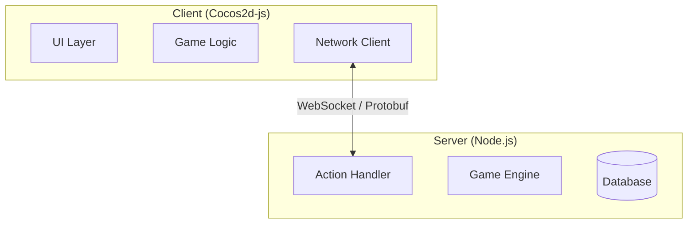
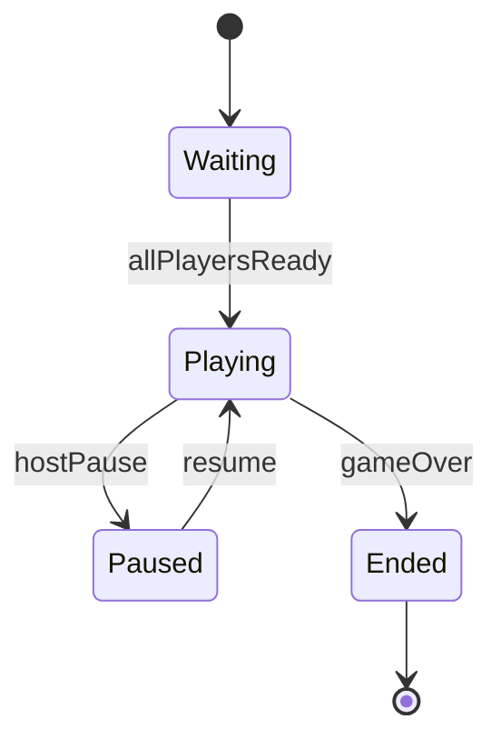
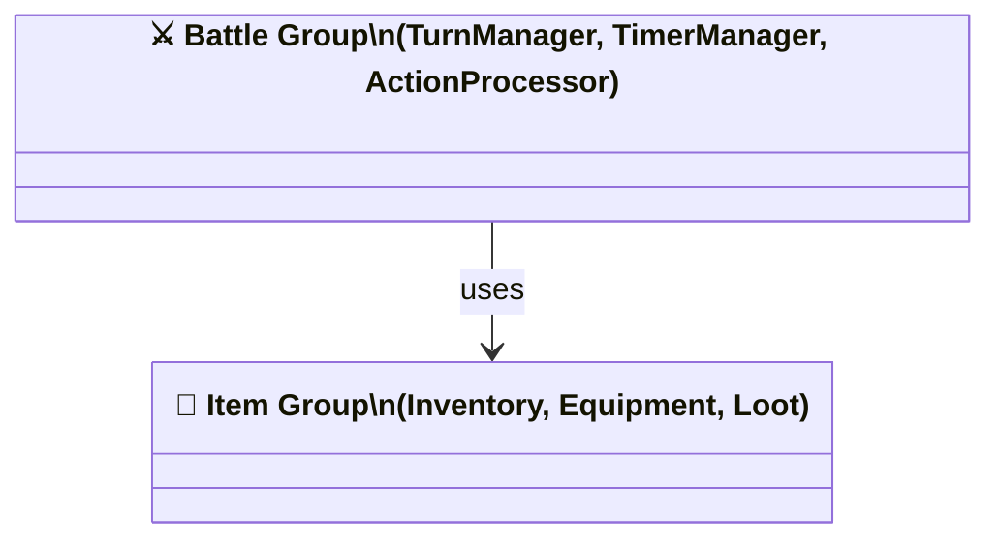

# Dev Analyze Design Skill

## Role boundary (CRITICAL)

This skill covers **Analysis + Technical Design** in one command. It replaces both the former `dev-analyze` (analysis) and `dev-design` (diagram generation) skills. Do NOT create implementation tasks (that is `dev-tasks`'s job).

## Role/Owner

- Owner role: Architect
- Primary agent: Architecture Analyst
- Depends on: promoted specs at `specs/<feature_id>/`
- Handoff: outputs → `dev-tasks`

## Goal

1. Read specs and tech-requirements → produce `analysis-report.md` (run artifact)
2. Produce Mermaid diagrams organized by client/server/shared under `docs/dev/<feature_id>/`, structured in two levels: HIGH (overview/cluster) và DETAIL (per functional group)
3. Maintain INDEX.md files as numbered reading-order guides (HIGH before DETAIL)

## Inputs

- **feature_id** (required): `NNN-slug` (e.g., `003-elemental-hunter`)
- **--client-only** (flag): produce only client-side diagrams (shared diagrams still created)
- **--server-only** (flag): produce only server-side diagrams (shared diagrams still created)
- Neither flag: produce both client + server diagrams (default = `both`)

## Pre-flight (run before reasoning)

1. `python tools/scaffold_run.py <feature_id> promote`
   Creates the run folder + `input.md`. Note the printed path.
2. `python tools/mkdir.py docs/dev/<feature_id> docs/dev/<feature_id>/client docs/dev/<feature_id>/server`

---

## Phase 1 — Gather

### Required reads

- `specs/<feature_id>/requirements.md`
- `specs/<feature_id>/use-cases.md`
- `specs/<feature_id>/acceptance-criteria.md`
- `docs/design-docs/<feature_id>/design-doc.md`

### Tech-requirements reads

Read in this order and merge (feature-specific overrides global):

1. `docs/dev/tech-requirements.md` — global, shared across all features
2. `docs/dev/<feature_id>/tech-requirements.md` — feature override (skip if not found)

**If global `docs/dev/tech-requirements.md` does NOT exist:**
- Use AskUserQuestion to gather: engine/framework, language, platform, client-server architecture style, anti-spam/validation policy
- Write `docs/dev/tech-requirements.md` with the gathered answers
- Always include the two mandatory principles below (add even if user doesn't mention them)

**Tech-requirements MUST always contain (enforce — add if missing from any source):**

```
## Principles (Mandatory)

### Divide & Conquer
- Each module has a single, well-defined responsibility
- Modules communicate via explicit interfaces — no hidden coupling
- If a module has >3 responsibilities, split it before proceeding

### Test-Driven Development (TDD)
- Every module must have its test surface defined before implementation begins
- Tests are written before implementation code
- Test surface = list of behaviors/functions to test, not implementation details
```

**If feature-specific `docs/dev/<feature_id>/tech-requirements.md` does NOT exist:**
- This is fine — skip silently. Only create it if the user explicitly requests feature-level overrides.

### Conditional reads

- If `docs/dev/<feature_id>/` already has diagrams → read them (check for conflicts before Phase 3)
- If `memory/patterns.md` exists → read patterns relevant to architecture analysis
- If `memory/mistakes.md` exists → read mistakes relevant to architecture

---

## Phase 2 — Analyze → `analysis-report.md`

Write to: `docs/runs/<feature_id>/<YYYYMMDD_HHMM>_<run>/analysis-report.md`

### Structure (MUST include all sections)

#### 1) Tech Stack Summary

- Engine / framework
- Language
- Platform constraints (from REQ specs)
- Key libraries / dependencies (if known)
- Tech-requirements source: `global` / `feature-specific` / `newly created`

#### 2) Project Structure

- Client folder tree
- Server folder tree
- Shared types / contracts location

#### 3) Module Breakdown

For each module:

- **Module name** + scope tag: `[CLIENT]` / `[SERVER]` / `[SHARED]`
- **Responsibility** (1–2 sentences, single responsibility only)
- **Maps to ACs**: [AC-xxx-01, ...]
- **Key interfaces** (public API surface — names + signatures with full types, no bodies)
- **Data structures** (REQUIRED — list every non-trivial data structure used internally):
  - Use precise generic types: `Map<sessionId: string, timer: NodeJS.Timer>`, `ElementType[]` (FIFO), `Set<tileId: number>`
  - Do NOT use bare `object`, `any`, or untyped `Array`
  - Document cardinality: `1:N`, `keyed by X`, `ordered / unordered`
  - Example: `queue: ElementType[] — FIFO, max 8 elements; timers: Map<string, NodeJS.Timer> — keyed by sessionId`
- **Test surface** (list of behaviors/functions to test — derived from ACs and responsibility)
- **Dependencies** (other modules this depends on)
- **Diagram cluster** (which HIGH-level group this module belongs to — used in Phase 3 to create DETAIL files):
  e.g., `battle`, `inventory`, `ui`, `network` — modules with same cluster → same `class-<cluster>.md` DETAIL file

**Divide & Conquer check**: if any module has >3 responsibilities → split before continuing.

**Cluster planning note**: After listing all modules, summarize the clusters:
```
Clusters identified: battle (3 modules), inventory (2 modules), network (1 module)
→ Phase 3 DETAIL files: class-battle.md, class-inventory.md (network: single module → include in shared class-<group>.md)
```

#### 4) File Map

Table listing every file that will be created:

| File | Module | Scope | Public API signatures |
|------|--------|-------|----------------------|
| `server/src/battle/BattleManager.ts` | BattleManager | SERVER | `processTurn(action: PlayerAction): TurnResult` · `validateAction(action: PlayerAction): ValidationResult` |
| `client/src/queue/ActionQueue.ts` | ActionQueue | CLIENT | `enqueue(action: Action): void` · `dequeue(): Action\|null` · `playNext(): Promise<void>` |

This table drives Group 0 (Skeleton) in `dev-tasks`.

#### 5) Dependency Graph

- Text-based module → module graph
- Critical path (longest dependency chain)
- Flag any circular dependencies — must be resolved before Phase 3

#### 6) Architectural Decisions

For each decision:
- **Decision**, **Rationale**, **Alternatives considered**, **Status**: `[EXISTING]` or `[NEW]`

#### 7) Integration Analysis *(only if existing diagrams found)*

- Compatibility summary
- Additions proposed
- Conflicts (if any — see existing diagram handling in Phase 3)

#### 8) Risk Areas

- Technical risks derived from specs (complexity, ambiguity, performance, spam/validation edge cases)
- Each risk: description + suggested mitigation

#### 9) Open Questions

- Questions that need user input before diagrams can proceed
- Each: what + why it matters + options if known

### Existing architecture handling

- Mark preserved decisions as `[EXISTING]`, new ones as `[NEW]`
- If conflict with existing decisions → create a **Conflicts** section with options (keep / replace / hybrid) and use AskUserQuestion before proceeding

---

> ## CHECKPOINT — After Phase 2
>
> Use **AskUserQuestion** to present:
> - Module count, scope breakdown (client/server/shared)
> - File Map summary (file count per scope)
> - **Diagram plan**: clusters identified → HIGH files planned → DETAIL files planned
>   e.g., "3 clusters (battle, inventory, network) → 6 HIGH files + 5 DETAIL files"
> - Top risk areas
> - Open questions (if any)
>
> Ask: "Analysis done — proceed to generate diagrams?"
> - **Yes** → proceed to Phase 3
> - **No** → stop gracefully. Report artifacts at `docs/runs/<feature_id>/<ts>/`. Suggest user reviews and re-runs `/dev_analyze_design` or `/dev_tasks` when ready.

---

## Phase 3 — Diagram Generation

**REQUIRED:** Trước khi vẽ bất kỳ diagram nào, invoke `mermaid-diagram` skill bằng Skill tool. Tuân theo hướng dẫn của skill đó về theme, highlight, node spacing, và readable labels khi áp dụng cho từng diagram type.

---

### Two-level diagram structure (MANDATORY)

**Anti-pattern (NEVER do this):** Nhét tất cả detail vào một file diagram duy nhất. Điều này làm diagram không thể đọc được và khó maintain.

Mỗi diagram type phải có **hai cấp độ**:

| Level | Mục đích | Nội dung | Quy tắc |
|-------|----------|----------|---------|
| **HIGH** (overview) | Đọc đầu tiên — hiểu big picture | Actors, module clusters, main relationships — KHÔNG có field/method chi tiết | Max ~15 nodes; nhóm các module liên quan thành clusters |
| **DETAIL** | Đọc sau HIGH — hiểu từng phần | Full properties, methods, error paths, sub-flows | Một file per functional group/module cluster |

**Clustering rule cho HIGH-level class/usecase:**
Nếu module breakdown có ≥2 module cùng concern (e.g., battle, inventory, UI) → tạo cluster node trong HIGH diagram thay vì liệt kê từng class.

---

### Output structure

```
docs/dev/<feature_id>/
  INDEX.md                              ← reading-order guide (overwrite each run)
  architecture.md                       ← [HIGH] shared: system layers, boundaries, communication protocol
  usecase.md                            ← [HIGH] shared: system-wide actors + capabilities
  class.md                              ← [HIGH] shared: data model clusters overview
  sequence-<flow>.md                    ← [HIGH] shared: client↔server happy-path flow
  state-<entity>.md                     ← [HIGH] shared: top-level state machine (optional — create if entity has explicit lifecycle states)
  client/
    usecase.md                          ← [HIGH] client actors + interactions
    class.md                            ← [HIGH] client module clusters overview
    class-<group>.md                    ← [DETAIL] full class detail per functional group
    sequence-<flow>.md                  ← [HIGH] client happy-path sequence
    sequence-<flow>-detail.md           ← [DETAIL] full sequence incl. error paths
    state-<entity>.md                   ← [HIGH] client-side state machine (optional)
    state-<entity>-detail.md            ← [DETAIL] sub-states, guarded transitions (optional)
    flow-<subsystem>.md                 ← [DETAIL] data/state flow within a subsystem
  server/
    usecase.md                          ← [HIGH] server actors + interactions
    class.md                            ← [HIGH] server module clusters overview
    class-<group>.md                    ← [DETAIL] full class detail per functional group
    sequence-<flow>.md                  ← [HIGH] server happy-path sequence
    sequence-<flow>-detail.md           ← [DETAIL] full sequence incl. error paths
    state-<entity>.md                   ← [HIGH] server-side state machine (optional)
    state-<entity>-detail.md            ← [DETAIL] sub-states, guarded transitions (optional)
    flow-<subsystem>.md                 ← [DETAIL] data/state flow within a subsystem
```

**Naming convention:**
- HIGH files: `architecture.md`, `usecase.md`, `class.md`, `sequence-<flow>.md`, `state-<entity>.md` (no suffix)
- DETAIL files: `class-<group>.md`, `sequence-<flow>-detail.md`, `state-<entity>-detail.md`, `flow-<subsystem>.md`

---

### Cross-references (MANDATORY — every file must have them)

**HIGH → DETAIL** (at top of HIGH file, below description line):

```markdown
# Class Overview (High-Level)
> Tổng quan các nhóm data model | Scope: shared | Level: HIGH

> **Chi tiết từng nhóm:** [BattleGroup](client/class-battle.md) · [ItemGroup](server/class-item.md)
```

**DETAIL → HIGH** (at top of DETAIL file, below description line):

```markdown
# Class — Battle Group (Detail)
> Full class definitions cho battle modules | Scope: server | Level: DETAIL

> **← Tổng quan:** [class.md](class.md) (xem mục #3 trong INDEX.md)
```

Rule: back-references MUST include the INDEX.md item number so readers can re-orient.

---

### Scope rule

| Flag | Creates |
|------|---------|
| *(neither)* | shared + client/ + server/ |
| `--client-only` | shared + client/ only |
| `--server-only` | shared + server/ only |

Shared diagrams are **always** created regardless of scope flag.

### Shared vs scoped classification

| Diagram goes to... | When... |
|-------------------|---------|
| Shared root | Spans both client and server, OR is a data model/DTO used by both |
| `client/` | Internal to client: rendering pipeline, animation queue, local state machine |
| `server/` | Internal to server: game logic, validation, spam check, action processor |

### Required diagram types (minimum set)

#### Architecture Overview — `flowchart TD` or `C4Context`

**Always create this first.** Shows the system as a whole: layers, components, and communication channels.

- `architecture.md` *(shared, HIGH)*: INDEX item #1 — the entry point for all readers
  - Show: Client layer, Server layer, Shared/Contract layer
  - Show: Communication protocol (WebSocket, HTTP, gRPC, etc.)
  - Show: External dependencies (DB, cache, third-party services)
  - Show: Major subsystem groupings as nodes (not individual classes)
  - No DETAIL counterpart — architecture.md itself is the single source at this level

Example structure:


#### Usecase — `flowchart TD`

Mermaid has no native usecase type — use `flowchart TD` with actor shapes.

- `usecase.md` *(shared, HIGH)*: system actors + high-level capability clusters
- `client/usecase.md` *(HIGH)*: client-side actor interactions
- `server/usecase.md` *(HIGH)*: server-side actor interactions

#### Sequence — `sequenceDiagram`

- `sequence-<flow>.md` *(shared, HIGH)*: client↔server happy-path only
- `sequence-<flow>-detail.md` *(shared, DETAIL)*: full flow with error branches, retries, edge cases — create only if happy-path file exists
- `client/sequence-<flow>.md` *(HIGH)*: client-internal happy path
- `client/sequence-<flow>-detail.md` *(DETAIL)*: full client flow
- `server/sequence-<flow>.md` *(HIGH)*: server-internal happy path
- `server/sequence-<flow>-detail.md` *(DETAIL)*: full server flow

#### Flow — `flowchart LR` or `TD` (choose by data direction)

Always DETAIL level:
- `client/flow-<subsystem>.md`: e.g., action queue playback → anim/fx pipeline
- `server/flow-<subsystem>.md`: e.g., game logic processing → result generation

#### Class — `classDiagram`

- `class.md` *(shared, HIGH)*: cluster nodes for shared data contracts — no field/method detail
- `class-<group>.md` *(shared, DETAIL)*: full class definitions per group (DTOs, Action/Result types)
- `client/class.md` *(HIGH)*: cluster nodes for client-side modules
- `client/class-<group>.md` *(DETAIL)*: full class definitions per client group
- `server/class.md` *(HIGH)*: cluster nodes for server-side modules
- `server/class-<group>.md` *(DETAIL)*: full class definitions per server group

**When to create DETAIL class files:** For each cluster in HIGH class.md that contains ≥2 classes, create a `class-<group>.md` DETAIL file.

#### State — `stateDiagram-v2` *(conditional)*

Create when a module/entity has **explicit lifecycle states** mentioned in the specs (e.g., game phases, connection states, player action states, session states).

**Trigger conditions** (create state diagrams if ANY of these are true):
- Specs mention states by name (e.g., "waiting", "in-progress", "ended")
- A module has a `state` or `phase` property in the data structures
- An AC describes behavior that changes depending on current state

**Files:**
- `state-<entity>.md` *(shared or scoped, HIGH)*: top-level states only (3–7 states max), happy-path transitions
- `state-<entity>-detail.md` *(DETAIL)*: full transitions incl. guards, sub-states, on-entry/on-exit actions

**Naming examples:**
- `state-game.md` — game session lifecycle
- `state-turn.md` — turn phase state machine
- `state-connection.md` — network connection states

**HIGH example:**


**DETAIL adds:** guard conditions (`[if timerExpired]`), sub-states (e.g., `Playing` expands to `SelectingAction / AnimatingResult`), on-entry actions.

### Class diagram requirements (CRITICAL — completeness applies to DETAIL files)

DETAIL class diagrams are the primary source of truth for data structures. They MUST be exhaustive:

**Properties:**
- Include **ALL** properties of each class — not just representative or public ones
- Include the data type for every property: `+propName: DataType`
- Use precise types — no `any`, no bare `object`:
  - Collections: `string[]`, `Map~string, Timer~`, `Set~number~`
  - Nullable: `ElementType | null` (write as `ElementType`)
  - Enums: reference the enum name
- Visibility: `+` public, `-` private, `#` protected

**Methods:**
- Include **ALL** method signatures: `+methodName(param: Type): ReturnType`
- Include parameter names AND types, not just types
- Include return types (use `void`, `Promise~T~`, union types where needed)

**Data structures:**
- Each DETAIL class diagram must reflect the exact data structures from §3 Module Breakdown
- For collection properties: show the element type in the class diagram
- Maps, Sets, queues must be shown with their key/value types

**Example — CORRECT (DETAIL):**
```
class TurnTimerManager {
    -timers: Map~string, NodeJS.Timer~
    -expiryCallbacks: Map~string, Function~
    +startTimer(sessionId: string, onExpire: Function) void
    +stopTimer(sessionId: string) void
    +resetTimer(sessionId: string) void
    +generateAutoAction(state: GameState, phase: TurnPhase) PlayerAction
    +isExpired(sessionId: string) boolean
}
```

**Example — WRONG (incomplete):**
```
class TurnTimerManager {
    +startTimer(sessionId) void
    +stopTimer() void
}
```

**Example — CORRECT (HIGH overview — cluster nodes only):**


### Diagram file format (MUST follow for every diagram file)

```markdown
# <Diagram Title> (<HIGH-Level> or <Detail>)
> <1-line description> | Scope: shared/client/server | Level: HIGH/DETAIL

> **Chi tiết:** [<group>](<path>) · [<group2>](<path2>)    ← HIGH files only
> **← Tổng quan:** [class.md](<path>) (INDEX #N)           ← DETAIL files only

```mermaid
...
```
```

### Diagram standards

- HIGH files: max ~15 nodes; DETAIL files: max ~20 nodes per diagram — split further if larger
- Node IDs must match module/class names from analysis-report
- Do NOT produce diagrams that contradict the File Map (use same names)

### Existing diagram handling (CRITICAL)

Check `docs/dev/<feature_id>/` for existing diagrams before writing:

- **No existing diagrams** → create freely
- **Existing, compatible** → preserve unchanged; mark additions with `%% [NEW]` in Mermaid source
- **Existing, conflict needed** → do NOT silently modify; use AskUserQuestion to show what exists vs what is proposed; only modify after user approval

### INDEX.md — feature index (reading order)

**File:** `docs/dev/<feature_id>/INDEX.md` (overwrite each run)

The INDEX.md MUST provide a numbered reading order so readers know where to start and how to navigate.

```markdown
# Index — <feature_id>
> Đọc theo thứ tự số để hiểu toàn bộ thiết kế. HIGH-level trước, DETAIL sau.

## Reading Order

| # | Keywords | File | Scope | Level | Mô tả |
|---|----------|------|-------|-------|-------|
| 1 | architecture, layers, protocol | architecture.md | shared | HIGH | Tổng quan system: layers, communication, dependencies |
| 2 | actor, use case, capability | usecase.md | shared | HIGH | Tổng quan actors và capabilities |
| 3 | data model, DTO, cluster | class.md | shared | HIGH | Tổng quan các nhóm data model |
| 4 | client, actor | client/usecase.md | client | HIGH | Actors phía client |
| 5 | server, actor | server/usecase.md | server | HIGH | Actors phía server |
| 6 | flow, request, sequence | sequence-main-flow.md | shared | HIGH | Happy-path client↔server |
| 7 | game state, phase, lifecycle | state-game.md | shared | HIGH | Game session state machine |
| 8 | battle, timer, detail | server/class-battle.md | server | DETAIL | Chi tiết classes nhóm Battle |
| 9 | spam, validation, detail | server/sequence-spam-check-detail.md | server | DETAIL | Full flow kiểm tra spam |
| 10 | turn, phase, sub-state | state-turn-detail.md | server | DETAIL | Sub-states của turn phase |
| ... | ... | ... | ... | ... | ... |

## Legend
- **HIGH**: Đọc đầu tiên — big picture, không có implementation detail
- **DETAIL**: Đọc sau khi đã nắm HIGH — chi tiết từng nhóm/module
```

Rules:
- HIGH-level files MUST come before DETAIL files in the numbered order
- Group by scope cluster: shared → client → server, HIGH before DETAIL within each scope
- Keywords: derived from diagram name, module names, AC IDs, risk area keywords (lowercase, comma-separated)

### INDEX.md — global index

**File:** `docs/dev/INDEX.md` (upsert — merge existing entries, do NOT delete other features' rows)

```markdown
# Global Index — docs/dev

| Feature | # | Keywords | File | Scope | Level |
|---------|---|----------|------|-------|-------|
| 003-elemental-hunter | 1 | system, actor | 003-elemental-hunter/usecase.md | shared | HIGH |
| 003-elemental-hunter | 6 | spam, validation | 003-elemental-hunter/server/sequence-spam-check-detail.md | server | DETAIL |
```

Rule: only overwrite rows whose Feature column matches current `feature_id`. All other rows must be preserved exactly.

---

## `input.md` content requirements

- `feature_id`
- `scope` (both / client / server)
- Specs paths read
- Tech-requirements source (global / feature-specific / newly created)
- Existing diagrams found: yes/no
- Diagram plan: clusters identified, HIGH file count, DETAIL file count

## `notes.md` content requirements

- Key architectural decisions made (not deferred)
- Tech-requirements status (found / created)
- Checkpoint outcome (proceeded / stopped)
- Diagram plan executed: HIGH files created (list), DETAIL files created (list), cross-references linked
- Diagrams preserved from previous run (with filenames), if any
- Conflicts resolved (if any) + user decisions
- Open questions still unresolved
- Recommended next step: `/dev_tasks <feature_id>` or resolve open questions first

## Completion criteria

- `analysis-report.md` contains all 9 sections (section 7 only if existing diagrams found)
- Every module maps to ≥1 AC ID and has a test surface defined
- Every module has a **Data structures** entry (even if empty: "none beyond primitive types")
- File Map is complete (every module has at least one file entry)
- No unresolved circular dependencies in dependency graph
- `architecture.md` created (shared, HIGH) — always required
- State diagrams created if trigger conditions met (lifecycle states in specs)
- Minimum diagram set produced per scope (HIGH + DETAIL for each type)
- **No single-file stuffing**: no diagram file contains all classes/flows in one flat diagram — DETAIL files must be split by functional group
- All DETAIL class diagrams are **complete** (all properties + all methods with full type signatures)
- All HIGH class diagrams show **cluster nodes** only — no field/method detail
- Every HIGH file has forward links to its DETAIL files
- Every DETAIL file has a back-reference to its HIGH file with the INDEX.md item number
- Feature INDEX.md created/overwritten with numbered reading order (HIGH before DETAIL)
- Global INDEX.md updated without losing other features' entries
- Run artifacts saved under correct path
- `notes.md` includes recommended next step
