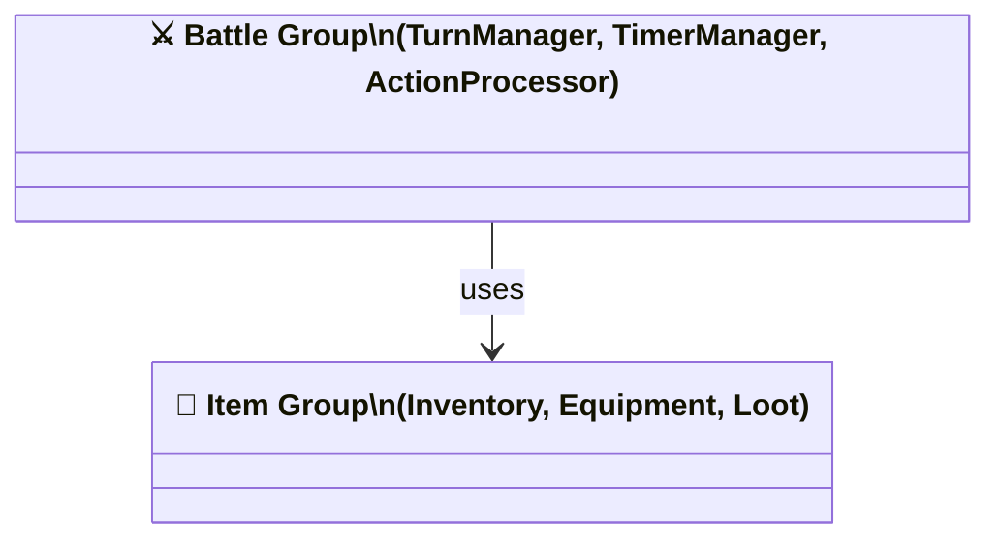

# Phase 3 — Diagram Standards (Detail)

> Read this file when writing each diagram file. Applies to all diagram types.

## Diagram File Format (every file must follow)

```markdown
# <Diagram Title> (<High-Level> or <Detail>)
> <1-line description> | Scope: shared/client/server | Level: HIGH/DETAIL

> **Detail files:** [<group>](<path>) · [<group2>](<path2>)    ← HIGH files only
> **← Overview:** [class.md](<path>) (INDEX #N)                ← DETAIL files only

```mermaid
...
```
```

## Cross-References (MANDATORY — every file must have them)

**HIGH → DETAIL** (at top of HIGH file, below description line):
```markdown
# Class Overview (High-Level)
> Overview of data model groups | Scope: shared | Level: HIGH

> **Detail files:** [BattleGroup](client/class-battle.md) · [ItemGroup](server/class-item.md)
```

**DETAIL → HIGH** (at top of DETAIL file, below description line):
```markdown
# Class — Battle Group (Detail)
> Full class definitions for battle modules | Scope: server | Level: DETAIL

> **← Overview:** [class.md](class.md) (see INDEX #3)
```

Rule: back-references MUST include the INDEX.md item number.

## Diagram Standards

- HIGH files: max ~15 nodes per diagram
- DETAIL files: max ~20 nodes per diagram — split further if larger
- Node IDs must match module/class names from analysis-report
- Do NOT produce diagrams that contradict the File Map

## Class Diagram Requirements (CRITICAL — applies to DETAIL files)

DETAIL class diagrams are the primary source of truth for data structures.

**Properties:**
- Include ALL properties — not just public or representative ones
- Include data type for every property: `+propName: DataType`
- Use precise types: `string[]`, `Map~string, Timer~`, `Set~number~`
- No `any`, no bare `object`
- Visibility: `+` public, `-` private, `#` protected

**Methods:**
- Include ALL method signatures: `+methodName(param: Type): ReturnType`
- Include parameter names AND types, not just types
- Include return types (`void`, `Promise~T~`, union types where needed)

**Data structures:**
- Each DETAIL class diagram must reflect the exact data structures from §3 Module Breakdown
- Maps, Sets, queues must be shown with key/value types

**Correct (DETAIL):**
```
class TurnTimerManager {
    -timers: Map~string, NodeJS.Timer~
    -expiryCallbacks: Map~string, Function~
    +startTimer(sessionId: string, onExpire: Function) void
    +stopTimer(sessionId: string) void
    +resetTimer(sessionId: string) void
    +generateAutoAction(state: GameState, phase: TurnPhase) PlayerAction
    +isExpired(sessionId: string) boolean
}
```

**Wrong (incomplete):**
```
class TurnTimerManager {
    +startTimer(sessionId) void
    +stopTimer() void
}
```

**Correct (HIGH — cluster nodes only):**


## Existing Diagram Handling (CRITICAL)

Check `docs/dev/<feature_id>/` for existing diagrams before writing:

- **No existing diagrams** → create freely
- **Existing, compatible** → preserve unchanged; mark additions with `%% [NEW]` in Mermaid source
- **Existing, conflict needed** → do NOT silently modify; use `AskUserQuestion` to show what exists vs what is proposed; only modify after user approval

## Feature INDEX.md

**File:** `docs/dev/<feature_id>/INDEX.md` (overwrite each run)

```markdown
# Index — <feature_id>
> Read in numbered order to understand the full design. HIGH-level first, DETAIL after.

## Reading Order

| # | Keywords | File | Scope | Level | Description |
|---|----------|------|-------|-------|-------------|
| 1 | architecture, layers, protocol | architecture.md | shared | HIGH | System overview: layers, communication, dependencies |
| 2 | actor, use case, capability | usecase.md | shared | HIGH | System actors and capabilities |
| 3 | data model, DTO, cluster | class.md | shared | HIGH | Data model group overview |
| ... | ... | ... | ... | ... | ... |

## Legend
- **HIGH**: Read first — big picture, no implementation detail
- **DETAIL**: Read after HIGH — per-group/module detail
```

Rules:
- HIGH-level files MUST come before DETAIL files in numbered order
- Group by scope: shared → client → server; HIGH before DETAIL within each scope
- Keywords: lowercase, comma-separated, derived from diagram name, module names, AC IDs

## Global INDEX.md

**File:** `docs/dev/INDEX.md` (upsert — merge existing entries, do NOT delete other features' rows)

```markdown
# Global Index — docs/dev

| Feature | # | Keywords | File | Scope | Level |
|---------|---|----------|------|-------|-------|
| 003-elemental-hunter | 1 | system, actor | 003-elemental-hunter/usecase.md | shared | HIGH |
```

Rule: only overwrite rows whose Feature column matches current `feature_id`. All other rows preserved exactly.

## notes.md Content (Phase 3 additions)

Append to the run's `notes.md`:
- Diagram plan executed: HIGH files created (list), DETAIL files created (list), cross-references linked
- Diagrams preserved from previous run (with filenames), if any
- Conflicts resolved (if any) + user decisions
- Recommended next step: `/dev_tasks <feature_id>` or resolve open questions first
