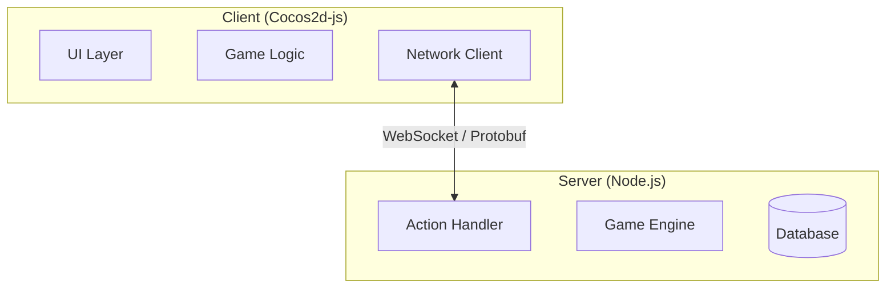
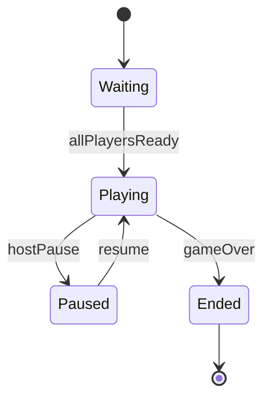

# Phase 3 — Diagram Types (Detail)

> Read this file at the start of Phase 3. Read phase3-diagram-standards.md when writing each diagram file.

## Two-Level Structure (MANDATORY)

Every diagram type has two levels:

| Level | Purpose | Content | Rule |
|-------|---------|---------|------|
| **HIGH** (overview) | Read first — big picture | Actors, module clusters, main relationships — NO field/method detail | Max ~15 nodes; group related modules into clusters |
| **DETAIL** | Read after HIGH | Full properties, methods, error paths, sub-flows | One file per functional group/cluster |

**Anti-pattern (NEVER do this):** Putting all detail into a single diagram file. This makes diagrams unreadable and hard to maintain.

**Clustering rule for HIGH-level class/usecase:**
If module breakdown has ≥2 modules with the same concern (e.g., battle, inventory, UI) → create a cluster node in the HIGH diagram instead of listing individual classes.

## Naming Convention

- HIGH files: `architecture.md`, `usecase.md`, `class.md`, `sequence-<flow>.md`, `state-<entity>.md` (no suffix)
- DETAIL files: `class-<group>.md`, `sequence-<flow>-detail.md`, `state-<entity>-detail.md`, `flow-<subsystem>.md`

## Output Structure

```
docs/dev/<feature_id>/
  INDEX.md                              ← reading-order guide (overwrite each run)
  architecture.md                       ← [HIGH] shared: system layers, boundaries, communication
  usecase.md                            ← [HIGH] shared: system-wide actors + capabilities
  class.md                              ← [HIGH] shared: data model clusters overview
  sequence-<flow>.md                    ← [HIGH] shared: client↔server happy-path
  state-<entity>.md                     ← [HIGH] shared: top-level state machine (optional)
  client/
    usecase.md                          ← [HIGH] client actors + interactions
    class.md                            ← [HIGH] client module clusters overview
    class-<group>.md                    ← [DETAIL] full class detail per functional group
    sequence-<flow>.md                  ← [HIGH] client happy-path sequence
    sequence-<flow>-detail.md           ← [DETAIL] full sequence incl. error paths
    state-<entity>.md                   ← [HIGH] client-side state machine (optional)
    state-<entity>-detail.md            ← [DETAIL] sub-states, guarded transitions (optional)
    flow-<subsystem>.md                 ← [DETAIL] data/state flow within a subsystem
  server/
    usecase.md                          ← [HIGH] server actors + interactions
    class.md                            ← [HIGH] server module clusters overview
    class-<group>.md                    ← [DETAIL] full class detail per functional group
    sequence-<flow>.md                  ← [HIGH] server happy-path sequence
    sequence-<flow>-detail.md           ← [DETAIL] full sequence incl. error paths
    state-<entity>.md                   ← [HIGH] server-side state machine (optional)
    state-<entity>-detail.md            ← [DETAIL] sub-states, guarded transitions (optional)
    flow-<subsystem>.md                 ← [DETAIL] data/state flow within a subsystem
```

## Scope Rules

| Flag | Creates |
|------|---------|
| *(neither)* | shared + client/ + server/ |
| `--client-only` | shared + client/ only |
| `--server-only` | shared + server/ only |

Shared diagrams are **always** created regardless of scope flag.

## Shared vs Scoped Classification

| Diagram goes to... | When... |
|-------------------|---------|
| Shared root | Spans both client and server, OR is a data model/DTO used by both |
| `client/` | Internal to client: rendering, animation queue, local state machine |
| `server/` | Internal to server: game logic, validation, spam check, action processor |

## Required Diagram Types

### 1. Architecture Overview — `flowchart TD` or `C4Context`

**Always create first.** One file only: `architecture.md` (shared, HIGH) — INDEX item #1.

Show: Client layer, Server layer, Shared/Contract layer, communication protocol, external dependencies, major subsystem groupings as nodes (not individual classes). No DETAIL counterpart.

Example structure:


### 2. Usecase — `flowchart TD`

Mermaid has no native usecase type — use `flowchart TD` with actor shapes.

- `usecase.md` (shared, HIGH): system actors + high-level capability clusters
- `client/usecase.md` (HIGH): client-side actor interactions
- `server/usecase.md` (HIGH): server-side actor interactions

### 3. Sequence — `sequenceDiagram`

- `sequence-<flow>.md` (shared, HIGH): client↔server happy-path only
- `sequence-<flow>-detail.md` (shared, DETAIL): full flow with error branches, retries, edge cases — create only if happy-path file exists
- `client/sequence-<flow>.md` (HIGH): client-internal happy path
- `client/sequence-<flow>-detail.md` (DETAIL): full client flow — create only if happy-path file exists
- `server/sequence-<flow>.md` (HIGH): server-internal happy path
- `server/sequence-<flow>-detail.md` (DETAIL): full server flow — create only if happy-path file exists

### 4. Flow — `flowchart LR` or `TD`

Always DETAIL level:
- `client/flow-<subsystem>.md`: e.g., action queue playback → anim/fx pipeline
- `server/flow-<subsystem>.md`: e.g., game logic processing → result generation

### 5. Class — `classDiagram`

- `class.md` (shared, HIGH): cluster nodes for shared data contracts — no field/method detail
- `class-<group>.md` (shared, DETAIL): full class definitions per group (DTOs, Action/Result types)
- `client/class.md` (HIGH): cluster nodes for client-side modules
- `client/class-<group>.md` (DETAIL): full class definitions per client group
- `server/class.md` (HIGH): cluster nodes for server-side modules
- `server/class-<group>.md` (DETAIL): full class definitions per server group

Create DETAIL class files for each cluster in HIGH class.md that contains ≥2 classes.

### 6. State — `stateDiagram-v2` (conditional)

Create when a module/entity has **explicit lifecycle states** in the specs.

**Trigger conditions (create if ANY true):**
- Specs mention states by name (e.g., "waiting", "in-progress", "ended")
- A module has a `state` or `phase` property in data structures
- An AC describes behavior that changes depending on current state

Files:
- `state-<entity>.md` (shared or scoped, HIGH): top-level states only (3–7 states max), happy-path transitions
- `state-<entity>-detail.md` (DETAIL): full transitions incl. guards, sub-states, on-entry/on-exit actions

Naming examples: `state-game.md`, `state-turn.md`, `state-connection.md`

HIGH example:


DETAIL adds: guard conditions (`[if timerExpired]`), sub-states (e.g., `Playing` expands to `SelectingAction / AnimatingResult`), on-entry/on-exit actions.
