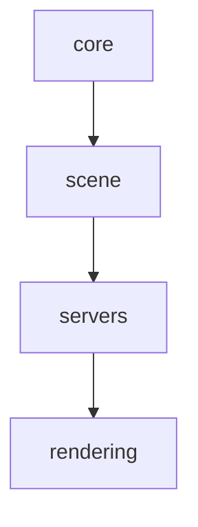

# Godot Deep Understanding Skill

**Version:** 1.0.0  
**Created:** 2026-03-25  
**Author:** Cốm Đào AI Assistant  
**Based on:** openclaw-deep-understanding v2.1, repo-local-analysis

---

## Overview

`godot-deep-understanding` là skill phân tích sâu codebase Godot Engine (C++), cho phép:

- **Phân tích architecture** Godot engine từ source code
- **Trả lời câu hỏi** về modules, classes, patterns
- **Generate markdown reports** với Mermaid diagrams
- **Memory integration** để lưu insights và tránh re-scan
- **Three depth modes**: overview (fast), module (balanced), file (deep)

Skill này dùng **regex-based parsing** (không cần compiler) để extract:
- Class/struct/enum declarations
- `#include` dependencies
- Module organization (core, scene, servers, rendering, etc.)
- Lines of code, file counts

---

## Quick Start

### 1. Set Godot Source Path

```bash
# Clone Godot nếu chưa có
git clone https://github.com/godotengine/godot.git

# Set environment variable
export GODOT_PATH="/path/to/godot"  # Linux/Mac
# or
set GODOT_PATH=D:\path\to\godot    # Windows
```

### 2. Run Analysis

```
User: "Phân tích kiến trúc Godot engine, lưu báo cáo vào godot-analysis.md"

→ Skill sẽ:
- Scan source code
- Generate report với diagrams
- Ask approval để write file
- Update memory với insights
```

### 3. View Results

Báo cáo được lưu ở `godot-analysis.md` với các sections:

- Executive Summary
- Architecture Diagram (Mermaid)
- Modules Breakdown (table)
- Dependency Graph
- Sample Files
- Observations

---

## Input Parameters

| Parameter | Type | Default | Description |
|-----------|------|---------|-------------|
| `query` | string | **required** | Câu hỏi bằng tiếng Việt về Godot |
| `contextPath` | string | `$GODOT_PATH` | Đường dẫn đến Godot source |
| `outputPath` | string | none | Nơi lưu báo cáo markdown |
| `depth` | enum | `"module"` | `overview` / `module` / `file` |
| `generateDiagrams` | boolean | `true` | Tạo Mermaid diagrams? |
| `maxFilesPerModule` | number | `10` | Giới hạn files/đọc mỗi module (module depth) |

---

## Depth Modes

### Overview (10-30s)
- Directory structure only (no file content)
- File counts, LOC (approximate)
- High-level architecture diagram
- Useful cho: quick questions, "what's in this codebase?"

### Module (1-3 min) **← DEFAULT**
- Group files by module (core, scene, servers, etc.)
- Read top N files per module (default 10)
- Extract exports/imports cho mỗi module
- Generate module-level diagrams
- Useful cho: most questions, module analysis

### File (3-10 min)
- Read **all** source files (có thể lớn!)
- File-level metadata (LOC, exports, imports)
- Comprehensive analysis
- Useful cho: full audit, specific file queries

---

## Examples

### Example 1: Quick Architecture Overview
```
"Godot engine architecture là gì? Tóm tắt ngắn gọn."
→ depth: overview (auto-selected)
→ Response: Text summary + architecture diagram
```

### Example 2: Module Deep Dive
```
"Phân tích module rendering trong Godot, các class chính là gì?"
→ depth: module
→ Response: Module purpose, key exports, dependency graph
```

### Example 3: Full Report
```
"Phân tích toàn bộ Godot, lưu vào D:\reports\godot-full.md"
→ depth: module (default)
→ outputPath: "D:\\reports\\godot-full.md"
→ Full markdown report saved + memory update
```

### Example 4: File-Level Detail
```
"Class Node định nghĩa như thế nào? File nào chứa nó?"
→ depth: file
→ Response: Exact file path, LOC, method signatures, includes
```

---

## How It Works

```mermaid
flowchart TD
  A[Start: User Query] --> B[Validate Input]
  B --> C[Resolve Godot Path<br/>env.GODOT_PATH]
  C --> D[Search Memory<br/>existing insights]
  D --> E[Scan Files<br/>(depth-based)]
  E --> F[Analyze Code<br/>(regex C++ parsing)]
  F --> G[Generate Diagrams<br/>(Mermaid)]
  G --> H[Build Vietnamese Response]
  H --> I{outputPath?}
  I -->|yes| J[Generate Full Report<br/>Request Approval]
  I -->|no| K[Return Response]
  J --> K
  K --> L[Memory Update<br/>(after approval)]
```

### Parsing Strategy (No AST)

Since Godot là C++ và không có AST parser nhẹ, skill dùng **regex heuristics**:

**Class detection:**
```regex
class\s+(\w+)\s*(?::\s*(?:public|protected|private)\s+(\w+))?\s*\{
```

**Include extraction:**
```regex
#include\s+[<"]([^>"]+)[>"]
```

**Module inference:** Dựa vào file path:
- `core/object/object.h` → module "core/object"
- `scene/2d/sprite_2d.h` → module "scene/2d"
- `servers/rendering/rendering_server.cpp` → module "servers/rendering"

---

## Output Format

### Chat Response (always)

```
# 📊 Phân tích Godot Engine (module depth)

**Tổng quan:** 500 files, 250,000 LOC, 15 modules

## 🔍 Câu trả lời cho: "Godot rendering system?"

Godot rendering system sử dụng Vulkan qua RenderingDevice...

## 📦 Top Modules
| Module | Files | LOC | Purpose |
|--------|-------|-----|---------|
| core/object | 15 | 5,000 | Core object system... |

💡 *Để xem báo cáo đầy đủ, dùng outputPath.*
```

### Full Report (markdown)

```markdown
# Godot Engine Deep Analysis Report
**Generated:** 2026-03-25T...
**Query:** "Godot engine architecture"
**Depth:** module
**Files Scanned:** 500
**Total LOC:** 250,000
**Modules:** 15

## Executive Summary
[Answer to query]

## Architecture Overview


## Modules Breakdown
| Module | Files | LOC | Key Exports | Purpose |
|--------|-------|-----|-------------|---------|

## Sample Files (by Module)
### core/object
| File | LOC | Exports | Imports |
|------|-----|---------|---------|

## Observations
- **info**: Large modules detected...
```

---

## Memory Integration

After approval, insights lưu vào `MEMORY.md` dưới dạng:

```markdown
### Godot Analysis Insights ( godot-deep-understanding )

#### core/object Module (analyzed 2026-03-25)
- **Purpose**: Core object system, reference counting...
- **Location**: `core/object`
- **Scale**: 15 files, 5,000 LOC
- **Key classes**: Object, RefCounted, ...

#### scene/main Module (analyzed 2026-03-25)
...
```

Lần sau, skill sẽ tự động đọc từ memory và tránh re-sash modules đã có.

---

## Configuration

### Environment Variables

```bash
# Required: Point to Godot source
export GODOT_PATH="/path/to/godot"  # Linux/Mac
$env:GODOT_PATH = "D:\\godot"       # Windows PowerShell

# Optional: Override default max files per module
export GODOT_MAX_FILES_PER_MODULE=20
```

### Default Search Paths

If `GODOT_PATH` không set, skill thử các vị trí:
- `~/godot`
- `~/projects/godot`
- `D:\PROJECT\CCN2\godot`
- `C:\godot`

---

## Limitations

1. **Regex parsing** không 100% chính xác:
   - Có thể miss complex templates, macros
   - `#ifdef` conditional code không được phân tích
   - Không resolve typedefs, using declarations

2. **Large codebases**:
   - Godot ~5000+ files, `file` depth có thể lâu (5-10 phút)
   - Memory usage cao
   - Khuyến nghị dùng `module` depth

3. **No AST**:
   - Không có type resolution
   - Purpose inference dựa trên heuristics (path + class names)

4. **Godot-specific optimization**:
   - Module patterns hardcoded cho Godot
   - Có thể cần customize cho C++ projects khác

---

## Testing

```bash
# Unit tests
node --test tests/skill.test.ts

# Integration test (set GODOT_PATH)
export GODOT_PATH="/path/to/godot"
# Then run a sample query through OpenClaw
```

---

## Performance Tips

- Use `depth: "overview"` cho quick exploration (~30s)
- Use `depth: "module"` cho most queries (1-3 min)
- Adjust `maxFilesPerModule` nếu muốn đọc nhiều/hơn ít files
- Set `generateDiagrams: false` nếu không cần diagrams (tăng tốc)
- Memory cache sẽ giúp lần sau nhanh hơn

---

## Troubleshooting

### "Godot path not found"
**Fix:** Set `GODOT_PATH` environment variable to Godot source root.

### "Parsing errors in some files"
**Cause:** Complex C++ constructs that regex không capture.
**Fix:** Những file đó auto-skipped. Check logs. Không ảnh hưởng kết quả tổng thể.

### "Out of memory"
**Cause:** `depth: "file"` trên codebase lớn.
**Fix:** Chuyển sang `depth: "module"` hoặc giảm `maxFilesPerModule`.

### "Diagrams empty"
**Cause:** Không detect được modules (wrong path or empty codebase).
**Fix:** Verify `contextPath` points to folder chứa `core/`, `scene/`, `servers/`.

---

## Technical Details

### File Scanning

- Recursive through directories
- Filter by extensions: `.cpp`, `.h`, `.hpp`, `.c`, `.cc`
- Exclude: `build/`, `bin/`, `.git/`, `platform/*/build/`
- Concurrent reads: 20 files at once
- Stream-based để giảm memory

### C++ Parsing Heuristics

**Exports:**
- `class ClassName [: parent] {`
- `struct StructName {`
- `enum class EnumName`
- Namespace declarations (optional)

**Imports:**
- `#include "local.h"` (project)
- `<system>` ignored

**Purpose Inference:**
- File path pattern matching (GODOT_MODULE_PATTERNS)
- Class name heuristics (Server, Physics, Rendering)
- Include analysis (includes from `servers/` → server implementation)

---

## Architecture

```
godot-deep-understanding/
├── SKILL.md            ← This file (instructions)
├── src/
│   ├── skill.ts        ← Main entry point (1200 lines)
│   ├── helpers.ts      ← Parsing, diagramming utilities
│   └── types.ts        ← TypeScript interfaces
├── tests/
│   └── skill.test.ts   ← Unit tests (40+ cases)
├── references/
│   └── validation.md   ← Validation rules
└── scripts/
    └── package_skill.py ← Packaging script
```

---

## Development

### Adding New Module Patterns

Edit `src/types.ts` → `GODOT_MODULE_PATTERNS`:

```typescript
export const GODOT_MODULE_PATTERNS = {
  // ... existing patterns
  my_new_module: /^my_new_module\//,
};
```

### Improving Parsing Accuracy

Modify `src/helpers.ts`:
- `extractExports()`: Add regex for more C++ constructs
- `extractImports()`: Handle preprocessor macros
- `inferModulePurpose()`: Add more path-based rules

### Adding Tests

Add to `tests/skill.test.ts`:

```typescript
describe("my new feature", () => {
  it("should handle edge case", () => {
    // test code
  });
});
```

---

## Changelog

### v1.0.0 (2026-03-25)
- Initial release
- Three depth modes: overview, module, file
- Mermaid diagram generation
- Memory integration
- Approval workflow
- Unit tests (40+ cases)
- Cross-platform (Node.js)

---

## References

- **OpenClaw Deep Understanding**: Template và pattern
- **Godot Engine Docs**: https://docs.godotengine.org
- **Godot GitHub**: https://github.com/godotengine/godot
- **Skill Creator Guide**: `D:\PROJECT\CCN2\.claude\skills\skill-creator\SKILL.md`

---

*© 2026 — Skill developed for CCN2 research project*